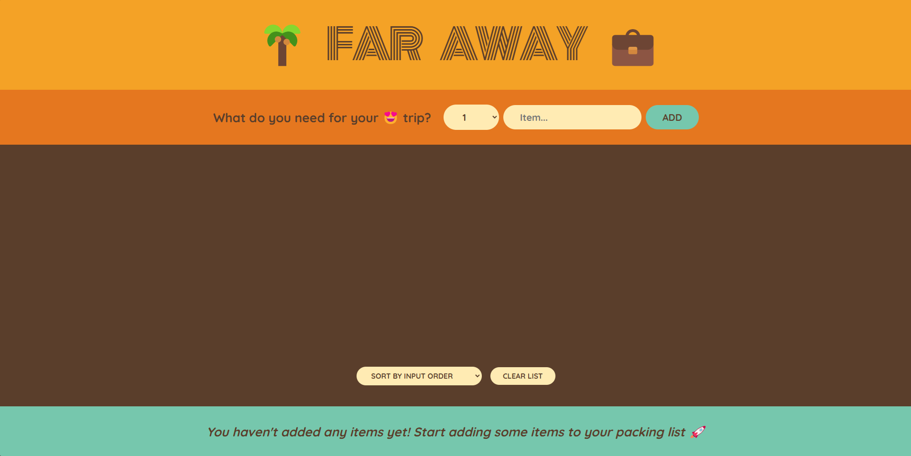
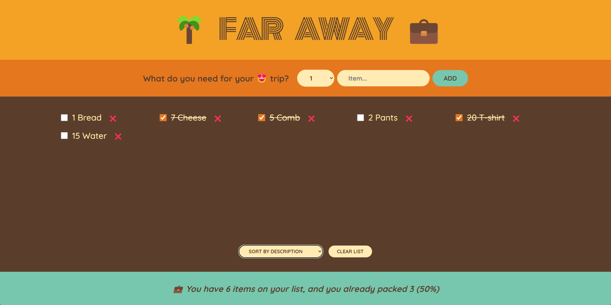
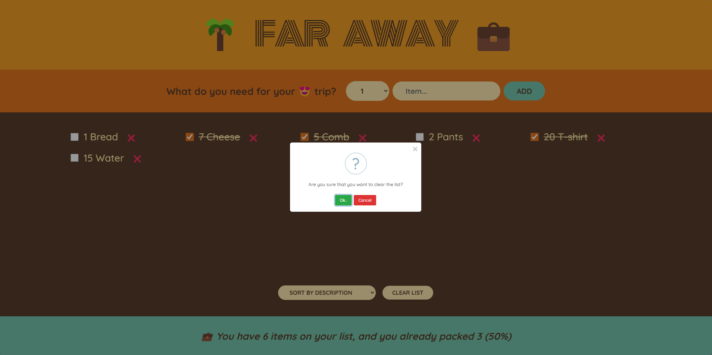

# Far Away - Your Ultimate Travel Packing List Manager

Far Away is a sleek and user-friendly travel list website designed to help you effortlessly create and manage your packing lists for upcoming trips. Whether you're heading out for a weekend getaway or embarking on a month-long adventure, Far Away ensures you never forget your essentials.

## Features

- **Create Custom Packing Lists**: Easily create packing lists tailored to each trip.
- **Manage Items**: Add, edit, or remove items from your packing list with just a few clicks.
- **Organize by Categories**: Categorize your items (e.g., clothing, toiletries, gadgets) for better organization.
- **Track Progress**: Check off items as you pack them to keep track of what’s left to do.
- **Intuitive Interface**: Enjoy a clean, intuitive interface that makes packing list management a breeze.
- **Responsive Design**: Access your packing lists from any device, whether you're at home or on the go.

## Screenshots

Landing Page:

Landing Page with list and sorting options:

Clear List:

## Why Choose Far Away?

- **Streamlined Packing**: Simplify the packing process and reduce the stress of travel preparation.
- **Personalized Lists**: Customize your lists to fit the unique needs of each trip, ensuring nothing is left behind.
- **Stay Organized**: Keep your items organized and easily accessible, so you can focus on enjoying your trip.

Far Away is built with React, ensuring a smooth and responsive user experience. Start planning your next adventure with Far Away and travel with confidence, knowing you have everything you need!

## Technologies Used

- **React**: The project is built using React, a JavaScript library for building user interfaces. React provides a component-based architecture and allows for efficient state management, making it ideal for interactive web applications.
- **States**: React's state feature is utilized to manage and update the data within the application. It enables the application to handle dynamic changes and update the UI accordingly.
- **Immutability of States**: React emphasizes immutability, ensuring that state objects are not mutated directly but instead are updated using methods such as setState. This approach helps to prevent unexpected side effects and simplifies state management.
- **Passing Props**: Props are used to pass data from parent components to child components. This allows for communication and data sharing between different parts of the application.
- **Lifting Up State**: In cases where multiple components need access to the same state or when the state needs to be modified by multiple components, the state is lifted up to a common ancestor component. This facilitates centralized state management and avoids data inconsistencies.
- **State Management**: React's built-in state management capabilities are leveraged to maintain and update the application's data. By managing state effectively, the application can respond to user interactions and update the UI accordingly.
- **Child Component to Parent Component Communication**: The project implements communication between child and parent components to enable actions and data flow in both directions. This allows child components to notify their parent components about certain events or provide data updates.
- **Derived States**: Derived states are computed based on existing state values. By utilizing derived states, the application can dynamically calculate values or apply specific logic based on the current state.
- **Controlled Elements**: React's controlled elements approach is employed to bind form elements, such as checkboxes and input fields, to the component's state. This ensures that the component's state always reflects the current value of the form elements.
- **Form Handling in React**: React's form handling capabilities are utilized to capture user input, validate data, and perform actions based on form submissions. This enables smooth and efficient handling of user interactions.
- **Complex Immutable Data Operations**: The project employs techniques for performing complex operations on immutable data structures. This allows for efficient manipulation of data without directly mutating the original objects.
- **Code Modularity**: To maintain a modular and organized code structure, components are separated into individual files. This promotes code reusability, readability, and easier maintenance of the application.

## Technologies Used

- **React**: The project is built using React, a JavaScript library for building user interfaces. React provides a component-based architecture and allows for efficient state management, making it ideal for interactive web applications.
- **States**: React's state feature is utilized to manage and update the data within the application. It enables the application to handle dynamic changes and update the UI accordingly.
- **Immutability of States**: React emphasizes immutability, ensuring that state objects are not mutated directly but instead are updated using methods such as setState. This approach helps to prevent unexpected side effects and simplifies state management.
- **Passing Props**: Props are used to pass data from parent components to child components. This allows for communication and data sharing between different parts of the application.
- **Lifting Up State**: In cases where multiple components need access to the same state or when the state needs to be modified by multiple components, the state is lifted up to a common ancestor component. This facilitates centralized state management and avoids data inconsistencies.
- **State Management**: React's built-in state management capabilities are leveraged to maintain and update the application's data. By managing state effectively, the application can respond to user interactions and update the UI accordingly.
- **Child Component to Parent Component Communication**: The project implements communication between child and parent components to enable actions and data flow in both directions. This allows child components to notify their parent components about certain events or provide data updates.
- **Derived States**: Derived states are computed based on existing state values. By utilizing derived states, the application can dynamically calculate values or apply specific logic based on the current state.
- **Controlled Elements**: React's controlled elements approach is employed to bind form elements, such as checkboxes and input fields, to the component's state. This ensures that the component's state always reflects the current value of the form elements.
- **Form Handling in React**: React's form handling capabilities are utilized to capture user input, validate data, and perform actions based on form submissions. This enables smooth and efficient handling of user interactions.
- **Complex Immutable Data Operations**: The project employs techniques for performing complex operations on immutable data structures. This allows for efficient manipulation of data without directly mutating the original objects.
- **Code Modularity**: To maintain a modular and organized code structure, components are separated into individual files. This promotes code reusability, readability, and easier maintenance of the application.

## Getting Started

To run the Far Away travel list website locally on your machine, follow these steps:

1. **Clone the repository**:
   Open your terminal and clone the Far Away repository from GitHub using the following command:
git clone https://github.com/your-username/far-away.git
Replace `your-username` with your GitHub username or the appropriate URL for the repository.

2. **Navigate to the project directory**:
Change into the project directory:
cd far-away

3. **Install dependencies**:
Once inside the project directory, install the necessary dependencies using npm:
npm install
This command will install all required packages and dependencies specified in the `package.json` file.

4. **Start the development server**:
After installing the dependencies, start the development server with:
npm start
This command will compile the React application and launch a development server.

5. **Access the Far Away website**:
Open your web browser and visit [http://localhost:3000](http://localhost:3000) to access the Far Away travel list website locally.

6. **Explore and use the application**:
- You should now see the Far Away application running in your browser.
- Sign up or log in to begin creating and managing your packing lists.
- Customize your lists, manage items, and experience the features described in the application.

7. **Modify and contribute (if applicable)**:
If you're contributing to the project or making modifications, make sure to follow the appropriate development practices and version control workflows.

8. **Shut down the server**:
To stop the development server when you're done, press `Ctrl + C` in the terminal where the server is running.

By following these steps, you can set up Far Away locally and start using it to manage your packing lists for upcoming trips efficiently.
